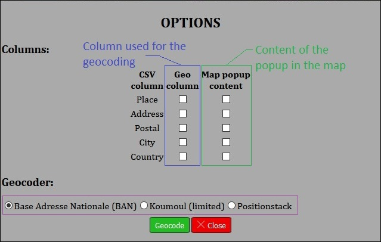

# Csv2Map

A mini-project which proposed different API to geocode a CSV and display the results on a map. These are also available in a table under the map and can be downloaded after the processing.

## Requirements

The project uses the library **PapaParse** to parse a CSV file. You can download it at [https://www.papaparse.com/](https://www.papaparse.com/) (version 5.0.2 is compatible). The folder containing PapaParse must be set in `src/`, next to the `index.html`.

## Installation

Rename the file `geocoders.json.ini` in `geocoders.json`. Open it and replace the pattern *YOUR_ACCESS_KEY* when you have access to a key for the wanted geocoder. Three geocoders are configured and proposed:

|                                API                               |                   Sign up required                  | Key required |           Comment          |
|:----------------------------------------------------------------:|:---------------------------------------------------:|:------------:|:--------------------------:|
|  [Base Adresse Nationale (BAN)](https://geo.api.gouv.fr/adresse) |                          No                         |      No      | French governmental API |
| [Koumoul](https://koumoul.com/s/geocoder/api-doc) (free version) | No (but the number of queries is very limited)   |      No      |                            |
|     [Positionstack](https://positionstack.com/documentation)     |                         Yes                         |      Yes     |                            |

## Usage

Upload a CSV file from your device, by clicking on the button **Upload CSV file** on the top right of the page. Choose the wanted file in your file system and open it.
A popup with the options is displayed as in the figure below:

At least, one of the column have to be used for the geocoding, otherwise you cannot geocode your file.

The results are displayed in the table and on the map. If no position is found for a given geocoder, the field *latitude* and *longitude* are empty.
If the results are satisfactory then you have the possibility to download those by clicking of the newly button on the top right **Download GeoCSV**.

## Author

© Bruno Verchère 2020
